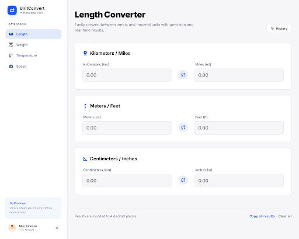

# Unit Converter

Modern, professional unit converter web application with a clean design system. Built using Vanilla JavaScript with TDD approach.



## Features

- **Multi-category Conversion**: Length, Weight, Temperature
- **Real-time Conversion**: Instant results as you type
- **History & Favorites**: Save and track your conversions
- **Formula Display**: View conversion formulas
- **Mobile Responsive**: Works on all devices (320px+)
- **LocalStorage Persistence**: Data persists across sessions

## Tech Stack

- HTML5, Tailwind CSS, Vanilla JavaScript (ES6+)
- Inter Font, Custom Design System
- LocalStorage API
- No build tools, no external dependencies

## Design System

Based on **DESIGN.md** with:
- Primary Color: `#135bec`
- Inter Font Family
- Border Radius: 4px/8px/12px
- Professional spacing and typography system

## Quick Start

```bash
# Open in browser
open index.html

# Or serve locally
npx serve .
```

## Project Structure

```
.
├── index.html           # Main application
├── js/
│   ├── app.js          # Main app logic
│   ├── converter.js    # Conversion functions
│   ├── storage.js      # LocalStorage operations
│   ├── converter.test.js
│   └── storage.test.js
├── docs/
│   ├── DESIGN.md       # Design system documentation
│   ├── PRD.md          # Product requirements
│   └── IMPLEMENTATION.md
├── test.html           # Test runner
└── CLAUDE.md           # Development guidelines

```

## Testing

```bash
# Open test runner in browser
open test.html

# Or run in console
# Tests are included in converter.test.js and storage.test.js
```

All features are built with TDD:
- ✅ Conversion accuracy tests (100km = 62.1371mi, 0°C = 32°F)
- ✅ Edge cases (0, negatives, large numbers)
- ✅ LocalStorage operations
- ✅ Input validation

## Development Workflow with AI Tools

This project demonstrates a modern AI-assisted development workflow:

### 1. Design Generation (Stitch MCP)
```
@stitch Unit Converter 만들어줘. 모던하고 깔끔한 스타일.
```
- Creates professional UI design using Google Stitch AI
- Generates HTML with Tailwind CSS styling
- Provides visual preview and downloadable code

### 2. Design Documentation (Stitch MCP)
```
@stitch 디자인 컨텍스트 추출해서 DESIGN.md 작성해줘
```
- Extracts complete design system from Stitch
- Documents colors, typography, spacing, components
- Creates comprehensive **docs/DESIGN.md**

### 3. Apply to Existing Project (Claude Code)
```
DESIGN.md 보고 기존 index.html 디자인 개선해줘.
기능(JS)은 그대로 유지.
```
- Reads DESIGN.md specifications
- Applies design system to existing functional code
- Preserves all JavaScript functionality
- Updates only visual styling

**Result**: Professional design without losing working features.

## Commands

```bash
# Development
open index.html        # Run application

# Testing
open test.html         # Run test suite

# Deployment
npm run deploy         # Deploy to Vercel (vercel.json configured)
```

## Development Guidelines

See **CLAUDE.md** for detailed guidelines:
- ✅ TDD approach (write tests first)
- ✅ Tailwind utility classes only
- ✅ 4 decimal places precision
- ✅ Mobile-first responsive design
- ❌ No external JS libraries
- ❌ No inline styles

## Git Workflow

```bash
# Feature branches
git checkout -b feature/new-converter

# Commit conventions
git commit -m "feat: add volume converter"
git commit -m "fix: temperature conversion accuracy"
git commit -m "test: add edge case tests"
```

## License

MIT

## Resources

- [Design System](docs/DESIGN.md) - Complete design documentation
- [PRD](docs/PRD.md) - Product requirements
- [Implementation Plan](docs/IMPLEMENTATION.md) - Development phases
- [Stitch AI](https://stitch.google.com) - Design generation tool

---

**Built with:** Claude Code + Google Stitch MCP
**Last Updated:** 2026-01-28
